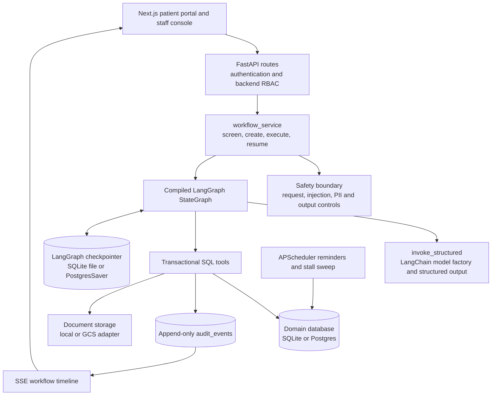
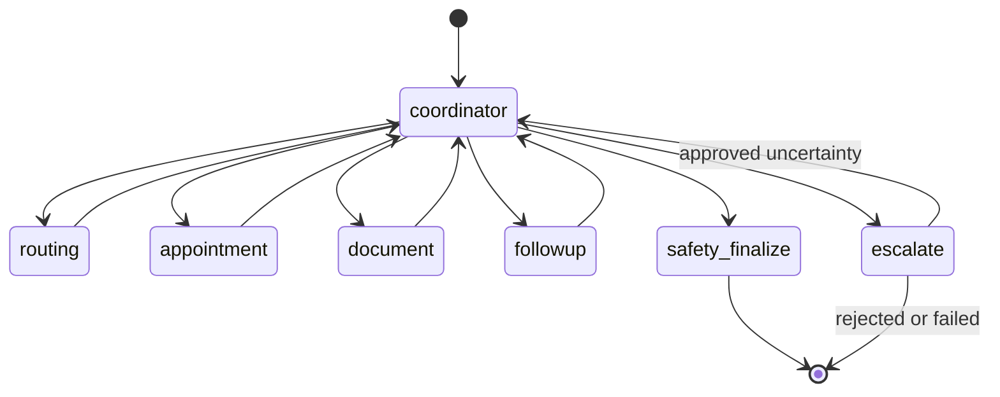
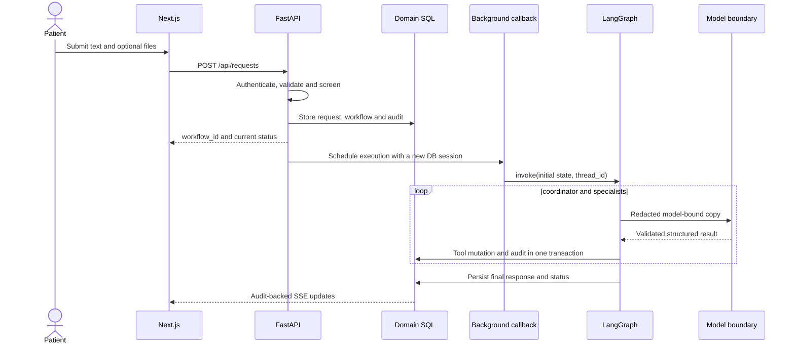
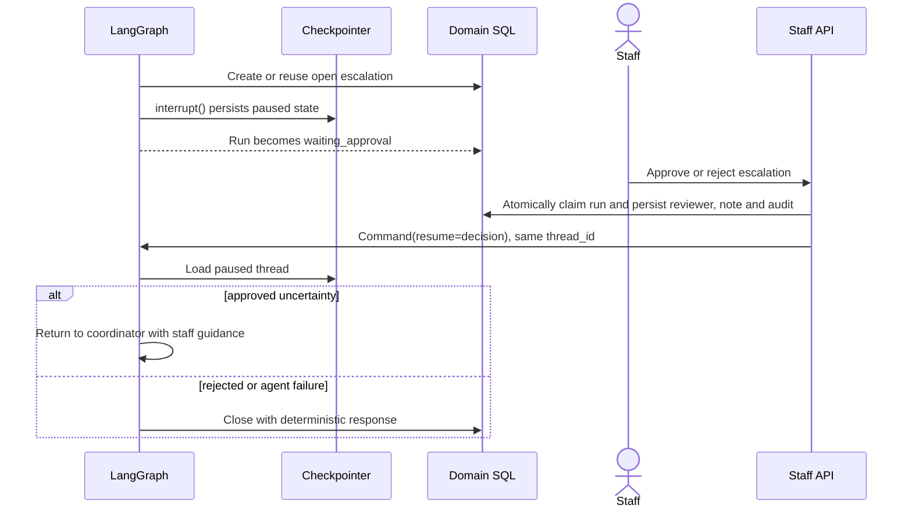
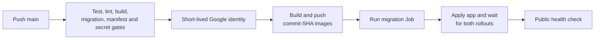

# AgentCare architecture

AgentCare is an administrative workflow system. It accepts patient requests,
persists their business state and coordinates database-backed work through an
explicit LangGraph state machine. It never owns clinical decisions.

This document owns runtime structure, graph control flow, state ownership and
deployment boundaries. Setup lives in the [project guide](../README.md).
Cloud commands live only in the [GCP runbook](deployment-gcp.md).

## Runtime component view

The browser uses the Next.js origin. Its `/api/*` rewrite forwards requests to
FastAPI so the httpOnly session cookie stays same-origin. `frontend/proxy.ts`
improves navigation for users without a cookie, but backend dependencies are
the authorization boundary.

`POST /api/requests` validates uploads, authenticates the patient, persists
the request and returns a workflow identifier. FastAPI then runs graph work in
a background callback that opens its own SQLAlchemy session. The request
therefore returns before any model call.

The graph and checkpointer are created once during application lifespan.
Each workflow receives a stable `thread_id` in the form `wf-{workflow_id}`.

## Safety before graph execution

`workflow_service.create_run` applies these gates in order:

1. `screen_request` checks deterministic emergency and medical-scope rules.
2. Emergency text creates an emergency escalation and localized guidance.
3. A request for diagnosis, prescription or dosage receives a refusal.
4. Remaining text enters the injection screen.
5. A blocked injection creates a safety escalation.
6. Allowed administrative work receives a `WorkflowRun` and enters the graph.

Emergency and medical refusals are terminal before graph execution. The
injection layer always runs deterministic rules first. Model Armor can occupy
the optional provider slot when configured. Otherwise a compatible classifier
can occupy it. Provider failure falls back to the deterministic result.

PII redaction is later and per model call. It does not alter the stored request
or create a globally redacted graph state. Nodes that include patient text
prepare a redacted copy at their own model boundary.

## LangGraph topology

The graph contains six model-assisted roles:

| Role | Responsibility | Domain effects |
|---|---|---|
| Coordinator | Select the next valid plan step | Audit only |
| Routing | Classify intent and resolve a department | Reads departments, can escalate |
| Appointment | Book, reschedule or cancel a slot | Transactional appointment and slot writes |
| Document | Classify uploads and check requirements | Updates document classification |
| Follow-up | Create reminders and follow-up tasks | Transactional reminder writes |
| Safety/finalization | Re-query facts, review and sanitize the response | Final response and audit |

The deterministic `escalate` node is not a model-assisted role. It creates or
reuses an escalation, changes the run to `waiting_approval` and pauses through
LangGraph `interrupt()`.

All model-assisted roles call
`backend/app/agents/llm.py::invoke_structured`. That function is the application policy
boundary. It builds models through LangChain `init_chat_model`, delegates
provider formatting and normal structured parsing to
`with_structured_output`, then applies AgentCare retry, compatibility,
corrective-prompt and fallback policy.

## Transition guards

The coordinator proposes a plan word, but code decides whether that transition
is legal. These guards do not depend on a prompt being followed:

- An agent error routes directly to `escalate`.
- An existing unresolved escalation routes directly to `escalate`.
- An empty, unknown or out-of-order plan routes to `escalate`.
- Appointment work must follow routing.
- Booking and rescheduling require a resolved department.
- Follow-up work must follow routing.
- Finalization must follow follow-up.
- A request with uploads must run the document role before finalization.

The checks use completed-step history rather than a single current-state flag.
That keeps legitimate revisits and checkpoint re-entry valid.

The graph is invoked with `durability="sync"`. A completed node side effect is
checkpointed before the next super-step starts.

## Patient request sequence

Uploads are validated as a group before storage. A rejected file therefore
does not leave a partially stored request. Stored document bytes are
deduplicated by patient and checksum.

## Staff interrupt and resume

LangGraph restarts an interrupted node from its beginning. The escalation
node therefore reuses the already-created row and does not repeat its first
audit write. The staff decision claim is also persisted so concurrent or
replayed resolution requests cannot decide the same escalation twice.

Crash resume is distinct from staff resume. A running workflow resumes from
its checkpoint with `invoke(None, config)` and the same `thread_id`. A paused
workflow moves only through the staff decision path. A new `thread_id` would
create a separate execution instead of continuing the original.

## Checkpoint state and domain state

The two stores solve different problems:

| Store | Owns | Does not own |
|---|---|---|
| LangGraph checkpointer | Node state, super-step position, interrupt payload and resume identity | Patient records, appointments or audit history |
| Domain SQL | Users, requests, appointments, documents, reminders, escalations and audits | Graph execution position |

SQLite development uses a separate checkpoint file to avoid file-locking
conflicts with the domain database. When `DATABASE_URL` is Postgres,
`PostgresSaver` uses the same Postgres server and database, runs `.setup()` and
keeps checkpoint tables logically separate from application tables.

The SQLAlchemy session is passed through LangGraph configurable runtime data.
It is not serialized into graph state.

## Persisted entities

| Entity | Purpose |
|---|---|
| `users` | Authenticated identity and role |
| `patient_profiles` | Patient-owned preferences |
| `departments`, `doctors` | Staff-maintained routing catalog |
| `appointment_slots`, `appointments` | Availability and claimed bookings |
| `required_documents`, `patient_documents` | Requirements, metadata and storage references |
| `workflow_runs` | Request text, status, response and stable thread identity |
| `reminders` | Due work and delivery state |
| `escalations` | Human handoff, reviewer and persisted decision |
| `agent_rules` | Staff-controlled procedural instructions |
| `audit_events` | Append-only record of mutations and agent progress |

Appointment claims use a conditional SQL update against a free slot. Only one
concurrent claim can succeed. Reminder batches, workflow resumes, staff
decisions and upload reuse also carry explicit idempotency behavior.

`write_audit` flushes inside the caller's transaction and does not commit by
itself. The business mutation and its audit row therefore succeed or roll back
together. Registration follows the same rule for the user, profile and
`user.registered` event.

## Audit and observability flow

Every domain tool mutation and agent node exit writes an `AuditEvent`.
Mutating API routes also record their changes. The event stores actor, action,
entity identity, timestamp and non-secret context.

The patient workflow timeline streams matching events over SSE. The staff
audit view reads the same table. Prometheus metrics describe HTTP behavior,
while optional Langfuse traces describe graph and model execution. Neither
replaces the append-only domain audit.

## Synchronous core and asynchronous edges

The SQLAlchemy and LangGraph transaction core is intentionally synchronous.
Tool methods share one ordinary SQLAlchemy session, transaction ownership is
explicit and graph invocation uses synchronous durability semantics. Changing
only an endpoint to `async def` would not make those internal calls
asynchronous.

Native asynchronous behavior exists where it has a concrete boundary:

- FastAPI lifespan startup and shutdown
- HTTP middleware
- SSE delivery and polling

Graph work leaves the request response path through FastAPI
`BackgroundTasks`, but the graph and its database work remain synchronous.
A true async conversion would require async nodes, awaited database and model
operations plus `.ainvoke` or `.astream`.

## GCP deployment boundaries

GCP is the sole cloud target. The committed design maps:

- container images to Artifact Registry
- frontend and backend workloads to GKE Autopilot
- domain SQL and Postgres checkpoints to Cloud SQL
- uploaded documents to GCS
- provider screening to Model Armor
- the backend Kubernetes service account to a runtime Google service account
  through GKE Workload Identity

Terraform owns those resources. A small bootstrap stack creates remote state,
enables the required services and establishes branch-restricted GitHub
Workload Identity. The main stack creates the application infrastructure.
Neither stack runs during an ordinary code release.

After one-time activation, GitHub Actions owns application delivery:

The renderer copies Kubernetes source to a temporary directory and replaces
validated deployment sentinels. It rejects mutable image tags and unresolved
values. The migration Job must complete before application manifests are
applied.

The existing public health endpoint was verified on 2026-07-28. That proves
the API and database were reachable at that time. It does not prove a current
Vertex response, Model Armor verdict or Langfuse export. Each new environment
must run the smoke checks in [GCP deployment](deployment-gcp.md).
