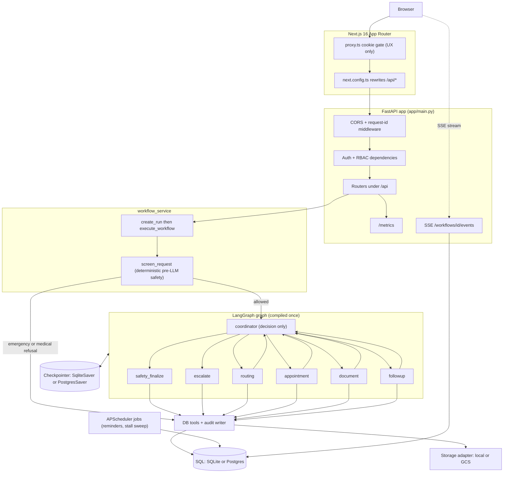

# AgentCare architecture

AgentCare is an agentic hospital-administration system. A patient sends a plain-language
request ("book me a cardiology appointment next week"), and a set of coordinated agents
turn it into real database work: department routing, appointment booking, document
coordination, reminders and post-visit follow-up. It handles administration only. It never
diagnoses, prescribes or doses, and that boundary is enforced in code, not just in prompts.

The backend is FastAPI plus LangGraph 1.2.9 (six agents behind one coordinator), persisted
to SQLAlchemy over SQLite locally or Postgres in a container. The frontend is Next.js 16
(App Router, Tailwind v4, shadcn) talking to the backend through a same-origin rewrite. Every
mutation and every agent step writes an append-only audit row, and a live SSE timeline plus a
`/metrics` endpoint make a run observable while it happens.

## System flow

The diagram below is a copy of `docs/architecture.mmd`, which is the source of truth. Edit the
`.mmd` file first, then regenerate this block.

Request path: the browser only ever talks to the Next.js origin. `next.config.ts` rewrites
`/api/*` to the backend so the httpOnly `access_token` cookie rides along same-origin, and
`proxy.ts` redirects a cookie-less browser away from `/portal/*` and `/staff/*`. That proxy
gate is UX only. The backend RBAC dependencies are the sole access control. FastAPI applies
CORS with an explicit origin list, stamps a request id into the structlog context, then routes
to a handler. `POST /api/requests` stores uploads, screens and creates a `WorkflowRun` row
synchronously, then hands graph execution to a `BackgroundTasks` callback with its own session,
so the request returns `{workflow_id, status}` before any LLM call.

## The six agents

The graph is a coordinator loop. `START` enters the coordinator, which is a pure decision node:
it appends one of six plan words to `state["plan"]` and never calls a node itself. A conditional
edge maps the latest plan word to the next node. Each specialist runs its own DB work, then
returns to the coordinator. `safety_finalize` and `escalate` are the two terminal nodes. Any
node that sets `state["error"]` forces `escalate` regardless of the coordinator's last decision,
so the graph stays safe even if the coordinator's own LLM call misreads an error. Each agent
catches its own exceptions and reports them as `state["error"]` rather than raising, so a node
boundary never crashes the graph.

| Agent | Prompt (`app/agents/prompts.py`) | Tools it owns | Structured output |
|---|---|---|---|
| Coordinator | `COORDINATOR` | none, audit only | `CoordinatorOutput{next_step, reasoning}` |
| Routing | `ROUTING` | `department_tools` (`list_departments`, `find_department`) + escalation, audit | `RoutingOutput{intent, department, confidence, reason}` |
| Appointment | `APPOINTMENT` | `appointment_tools` (`get_available_slots`, `book`, `reschedule`, `cancel`) + escalation, audit | `AppointmentOutput{slot_id, reason}` |
| Document | `DOCUMENT` | `document_tools` (`check_required_documents`; classification reads the persisted row) + audit | `DocumentOutput{document_type, confidence}` |
| Follow-up | `FOLLOWUP` | `followup_tools` (`create_reminder`, `create_followup_task`) + audit | `FollowupOutput{reminders[], followup_days_after}` |
| Safety | `SAFETY` | none domain-owned; re-queries DB rows and runs `sanitize_agent_output` | `SafetyOutput{safe, violations, rewritten}` |

Every structured field is required in the JSON schema. Optional-looking fields such as
`department` and `slot_id` are typed `T | None` with no Python default, because Groq strict mode
puts every property in `required` and a defaulted field would drop out and 400 the request.
The single LLM entry point is `app/agents/llm.py::chat_json`. Nothing else calls
`chat.completions` anywhere.

Each node builds its system message with `app/agents/memory.py::build_system_prompt`: the base
prompt above plus that agent's active procedural rules (`agent_rules`, staff-editable through
`/api/staff/agent-rules`, see ADR-14), fetched fresh on every call so a staff edit applies on the
very next request. The safety node also re-reads `PatientProfile.preferred_language` and
threads a "Respond in German/English" instruction into its user content; the deterministic
fallback draft it composes when the LLM call fails is rendered in that same language, so a
German-preferring patient never silently gets an English reply.

## Workflow lifecycle

1. Screen. `workflow_service.create_run` calls `screen_request` (deterministic, no LLM) first.
   An emergency or a medical-advice ask is terminal right here: the run gets its response and,
   for an emergency, an `emergency` escalation, with no graph and no LLM call.
2. Create run. An allowed request becomes a `WorkflowRun` row with status `running`, a
   `thread_id` of `wf-{id}` and a `workflow.started` audit event.
3. Background execute. The HTTP route adds `run_workflow_background` as a `BackgroundTasks`
   callback. It opens its own session and calls `execute_workflow`, which invokes the compiled
   graph with `config["configurable"] = {thread_id, db}`. The db session travels through config,
   never through the checkpointed state (a Session is not serializable and has no place in a
   checkpoint).
4. Nodes. The coordinator loop runs routing, appointment, document and follow-up as needed,
   each writing an `agent.<name>.completed` audit row on exit.
5. Finalize or escalate. `safety_finalize` composes the patient-facing answer from freshly
   re-queried rows, runs it past the LLM reviewer and the deterministic sanitizer, then ends the
   run. `escalate` opens an escalation and ends the run.
6. Crash-resume. `resume_workflow` calls `graph.invoke(None, config)` with the same `thread_id`,
   re-entering from the last saved super-step checkpoint. It is a no-op on an already-finished
   thread, so nothing re-executes or duplicates. A background task or scheduler sweep that never
   finished shows up as a run stuck in `running`, which the stall job escalates after 30 minutes.

The graph is built and compiled once at startup (`workflow_service.get_graph`). Its checkpointer
is opened as a context manager and held for the process lifetime through a module-level
`ExitStack`, closed by the FastAPI lifespan on shutdown.

## Data model

`patient_id` is always `users.id`. A patient login and its clinical record are the same identity.

| Table | Who writes | Who reads |
|---|---|---|
| `users` | auth register | auth, RBAC, every patient-data query |
| `patient_profiles` | auth register | patient self-service, safety draft |
| `departments`, `doctors`, `required_documents` | staff catalog admin (`department_tools`) | routing agent, document agent, slot listing |
| `appointment_slots` | staff slot generation, appointment tools (claim and free) | appointment agent availability |
| `appointments` | appointment tools (book, reschedule, cancel) | patient portal, safety draft, follow-up |
| `patient_documents` | `store_document` on upload, document agent (type update) | document agent, documents route, safety draft |
| `workflow_runs` | `workflow_service` | SSE timeline, patient and staff workflow views |
| `reminders` | follow-up tools, `send_due_reminders` (sent flag) | reminders route, safety draft |
| `escalations` | escalation tools (create, resolve) | staff escalation queue, workflow detail |
| `audit_events` | `write_audit`, from every tool, node and mutating route | SSE timeline, staff audit view |

Slot claims use a single conditional `UPDATE ... WHERE status = 'free'`, so two concurrent
bookings for one slot can never both win. The loser's update touches zero rows and raises
`ConflictError`. `write_audit` flushes but never commits, so an audit row lands in the same
transaction as the change it records.

## Deployment views

Honest status: the application code and the local container stack are real and run today. The repo
has a `backend/Dockerfile`, a `frontend/Dockerfile` and a `docker-compose.yml` at its root. The GCP
path below is the decided design, not built: there is no `infra/` directory yet, and the GCS SDK is
not installed (`GCSStorage` imports it lazily and raises a clear `AppError` if selected without it).

- Local (implemented now). SQLite at `agentcare.db`, a separate LangGraph checkpoint file at
  `checkpoints.db`, uploads under `./uploads`, `uvicorn app.main:app` and `next dev`. No keys
  needed beyond an LLM endpoint. This is the default from `.env.example`.
- Docker Compose with Postgres (implemented now). `docker compose up --build` starts five services:
  `postgres:16-alpine` with a health check, the FastAPI backend, the standalone Next.js frontend,
  Prometheus and Grafana. The backend container entrypoint runs `alembic upgrade head` and the
  idempotent seed before `uvicorn`, so the database is ready as soon as the container reports
  healthy. `DATABASE_URL` switches SQLAlchemy and the checkpointer to Postgres over
  `psycopg[binary]`, so checkpoints live in the same database and `PostgresSaver.setup()` runs once.
  The frontend builds with `output: "standalone"`. Prometheus scrapes the backend `/metrics`
  endpoint every 15 seconds, and Grafana loads a provisioned AgentCare dashboard. Ports: frontend
  3000, backend 8000, Prometheus 9090, Grafana 3001 (`admin` / `admin`).
- GCP (designed). FastAPI and the standalone Next.js build on Cloud Run, Postgres on Neon free
  tier for the live demo (Cloud SQL on the enterprise path), documents in a GCS bucket with
  uniform bucket-level access, secrets in Secret Manager, keyless CI through Workload Identity
  Federation and the staff surface behind Identity-Aware Proxy. See `docs/decisions.md` for the
  reasoning and verified costs.

## Observability

- Audit trail. The append-only `audit_events` table is the primary record. Every tool mutation,
  agent node exit and mutating route writes one row through `write_audit`.
- SSE timeline. `GET /api/workflows/{id}/events` streams new audit rows for one run, polling
  every second, heartbeating every 15 seconds and closing with `event: done` at a terminal
  status. It opens a fresh session per poll so it sees whatever the background task has since
  committed, and sends `Cache-Control: no-cache` plus `X-Accel-Buffering: no` for proxies.
- Metrics. `prometheus-fastapi-instrumentator` exposes `/metrics` with request rate, latency and
  error counters. A Prometheus plus Grafana compose stack is the designed local dashboard, and
  Google Managed Service for Prometheus is the documented GKE path.
- Tracing (optional, env-gated). When both Langfuse keys are set, `workflow_service._observability`
  attaches a Langfuse `CallbackHandler` and stamps the `workflow_id` into the trace through
  `propagate_attributes`. With the keys empty (the default) the path is inert and never imports
  `langchain`.
