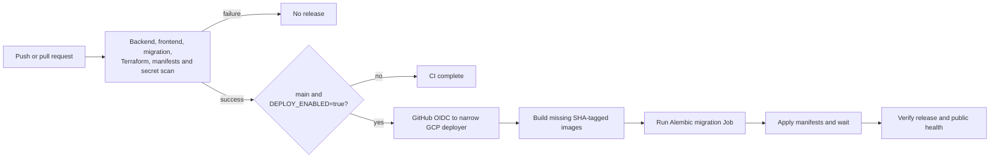

# CI/CD and GitHub setup

AgentCare separates infrastructure changes from application releases:

- Terraform infrastructure is planned, reviewed and applied by an operator.
- `.github/workflows/ci.yml` validates every change.
- The same workflow releases a successful `main` commit when
  `DEPLOY_ENABLED=true`.
- `.github/workflows/agentcare-checks.yml` runs the challenge-owned checks.

GitHub Actions has no Terraform apply identity and no project-IAM-admin role.
That is intentional. See [GCP deployment](deployment-gcp.md) for infrastructure.

## Application delivery



### Validation gates

| Job | What must pass |
|---|---|
| `test` | Ruff, compile, backend/eval tests and scoring self-test |
| `frontend` | install, production dependency audit, lint and build |
| `migrations` | a clean database reaches the Alembic head |
| `infrastructure` | Terraform format and offline validation for both stacks |
| `manifests` | every overlay renders and passes strict kubeconform checks |
| `secret-scan` | Gitleaks scans the complete Git history |

The deployment job depends on all six. It never runs on a pull request or a
non-`main` branch.

### Release behavior

The release job:

1. validates all required deployment variables
2. exchanges GitHub OIDC for a short-lived Google credential
3. reuses an image if the immutable commit tag already exists
4. otherwise builds and pushes backend and frontend images
5. resolves both image digests
6. gets credentials for the configured GKE cluster
7. verifies `agentcare-secrets` exists
8. runs the database migration Job and waits for completion
9. applies the application overlay and waits for both rollouts
10. verifies the cluster requests the expected commit tag
11. checks `PUBLIC_URL/api/health`
12. writes the SHA, digests and outcomes to the job summary

There is no `latest` tag. A released Git SHA always names the same image.

### Enable or stop releases

`DEPLOY_ENABLED` is a repository variable:

```bash
gh variable set DEPLOY_ENABLED --body true
```

Pause application delivery without deleting the workflow:

```bash
gh variable set DEPLOY_ENABLED --body false
```

CI remains active in both cases.

## Keyless Google authentication

The bootstrap stack creates one Google service account for application
delivery. It can write Artifact Registry images, view the cluster, update
Kubernetes workloads and consume enabled APIs. It cannot change project IAM,
apply Terraform, destroy GKE or delete Cloud SQL.

The Workload Identity Federation provider accepts a token only when all of
these claims match:

- immutable GitHub repository ID
- immutable GitHub owner ID
- `refs/heads/main`
- GitHub environment `production`
- workflow ref ending in `.github/workflows/ci.yml@refs/heads/main`

No JSON service-account key exists in GitHub.

## GitHub configuration

### 1. Authenticate and inspect the repository

```bash
gh auth login
gh auth status
gh repo view --json nameWithOwner,url,visibility
```

The submission repository must be public and contain the real source.

### 2. Add the production variables

After Terraform, DNS and bootstrap are ready:

```bash
make gcp-github-vars \
  PROJECT_ID=your-project \
  PUBLIC_URL=https://your-new-host \
  LLM_PROFILE=groq
```

The target creates the `production` environment if needed and synchronizes
non-secret values:

| Variable | Source |
|---|---|
| `GCP_PROJECT_ID` | operator choice |
| `GCP_REGION` | operator choice |
| `GCP_WORKLOAD_IDENTITY_PROVIDER` | bootstrap output |
| `GCP_DEPLOYER_SERVICE_ACCOUNT` | bootstrap output |
| `GKE_CLUSTER` | main Terraform output |
| `DOCUMENTS_BUCKET` | main Terraform output |
| `MODEL_ARMOR_TEMPLATE` | main Terraform output |
| `PUBLIC_URL` | new DNS origin |
| `LLM_PROFILE` | `backend/llm.yaml` profile |
| `LANGFUSE_PUBLIC_KEY` | optional Langfuse project key |
| `LANGFUSE_BASE_URL` | optional Langfuse region URL |
| `LANGFUSE_SAMPLE_RATE` | `0` to `1`, default `0` |

It also sets repository variable `DEPLOY_ENABLED=true`.

These are configuration values, not credentials. Model, database, JWT and
Langfuse secret values remain in the Kubernetes Secret.

### 3. Protect production

For a personal hackathon repository, the environment primarily scopes
variables and OIDC. A company repository should also add:

- required reviewers for production
- deployment branch restricted to `main`
- branch protection with required CI checks
- CODEOWNERS for `.github/`, `infra/` and security code

The OIDC condition still enforces `main`, the production environment and the
specific workflow even when repository UI protection is misconfigured.

## First and later releases

The first release requires infrastructure, database/user, runtime Secret and
DNS. Follow [GCP deployment](deployment-gcp.md), then:

```bash
make gcp-release \
  PROJECT_ID=your-project \
  PUBLIC_URL=https://your-new-host
```

This checks the Kubernetes Secret, verifies local `main` equals `origin/main`,
dispatches `ci.yml` and waits for the result.

After activation, a normal change is:

```bash
git status --short
git push origin main
gh run watch
```

Every successful `main` push releases automatically. A manual redeploy of the
same commit reuses its immutable images:

```bash
gh workflow run ci.yml --ref main
gh run watch
```

## Secrets

### Where each secret belongs

| Secret | Location |
|---|---|
| Groq or compatible model key | local `.env`; GKE `agentcare-secrets` |
| `JWT_SECRET` | local `.env`; GKE `agentcare-secrets` |
| `DATABASE_URL` | GKE `agentcare-secrets` |
| Langfuse secret key | local `.env`; GKE `agentcare-secrets` |
| submission token | GitHub Actions secret `SUBMISSION_TOKEN` |
| Google credentials | local gcloud/ADC or short-lived GitHub OIDC |

Never put them in:

- `.env.example`
- GitHub variables
- Terraform variables or state
- Kubernetes ConfigMaps
- committed manifests
- issue text, screenshots or logs

The workflow-generated `gha-creds-*.json` files are ignored by Git and Docker.

### Add the challenge submission token

The submission token identifies the entry when the challenge check reports
back. It does not deploy the application.

If a token has appeared in chat, a screenshot or a shell history, rotate it in
the challenge dashboard before use. Do not paste it into a command argument.

```bash
read -s SUBMISSION_TOKEN
printf '\n'
gh secret set SUBMISSION_TOKEN --body "$SUBMISSION_TOKEN"
unset SUBMISSION_TOKEN
```

Confirm only the secret name:

```bash
gh secret list
```

Push a commit to trigger the challenge workflow:

```bash
gh run list --workflow agentcare-checks.yml
```

The repository workflow requests GitHub OIDC, downloads the challenge checks
from the configured challenge API and reports results. The secret value is
never printed.

## Langfuse release configuration

Langfuse is optional. Set the public configuration through the production
environment:

```bash
make gcp-github-vars \
  PROJECT_ID=your-project \
  PUBLIC_URL=https://your-new-host \
  LANGFUSE_PUBLIC_KEY=pk-lf-example \
  LANGFUSE_BASE_URL=https://cloud.langfuse.com \
  LANGFUSE_SAMPLE_RATE=0.1
```

Put only `LANGFUSE_SECRET_KEY` in `agentcare-secrets`. Tracing stays disabled
when either key is missing or the sample rate is zero. Exported attributes use
the allowlist described in [observability](observability.md).

## Failure guide

| Symptom | Check |
|---|---|
| deploy job skipped | `gh variable get DEPLOY_ENABLED` |
| OIDC denied | bootstrap condition, production environment and `main` ref |
| image push denied | deployer Artifact Registry role |
| Secret check failed | create `agentcare-secrets` in the exact cluster |
| migration failed | migration Job logs and `DATABASE_URL` |
| rollout timed out | pod events, image pull and readiness probe |
| public health failed | DNS, managed certificate, Ingress and backend health |
| challenge checks failed | rotated `SUBMISSION_TOKEN` secret and workflow logs |

Useful commands:

```bash
gh run list --limit 10
gh run view RUN_ID --log-failed
gh variable list
gh variable list --env production
gh secret list
```

## Why Terraform is not automatic here

An industry Terraform pipeline plans with a narrowly scoped identity, stores
the exact plan as a protected artifact, presents that plan for human review
and applies only that artifact after approval. The deleted workflow approved a
job before its plan existed and gave the same repository principal access to
an account with project-IAM-admin.

For this single-operator hackathon repository, local saved-plan review is
safer and easier to audit. A larger team should move Terraform to a dedicated
platform repository or HCP Terraform before automating apply and destroy.
