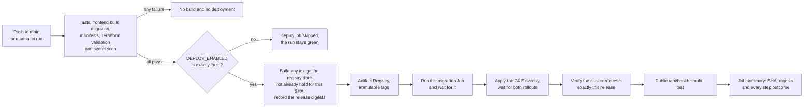
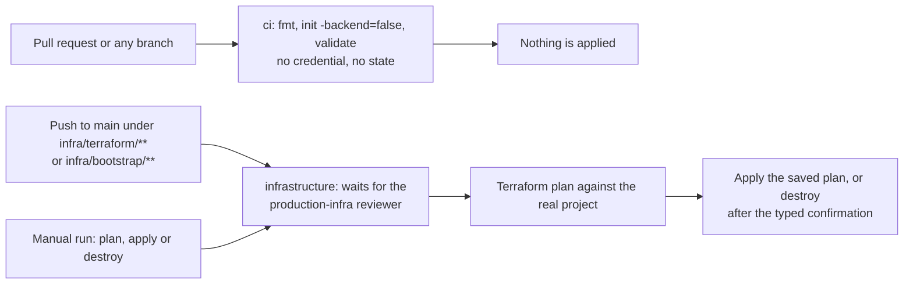

# CI/CD and GCP releases

AgentCare has two GitHub Actions workflows and two Google identities.
`.github/workflows/ci.yml` tests every commit and releases the application.
`.github/workflows/infrastructure.yml` is the only workflow that runs Terraform
against the real project. Neither holds a service-account key. Both exchange the
GitHub OIDC token for a Google identity through Workload Identity Federation.

| Workflow | Trigger | Google identity | GitHub environment |
|---|---|---|---|
| `ci` | every push and pull request, plus a manual run | `agentcare-github-deployer` | `production`, on the deploy job only |
| `infrastructure` | push to `main` under `infra/terraform/**` or `infra/bootstrap/**`, plus a manual run | `agentcare-github-infra` | `production-infra`, required reviewer |

Local operator commands live in the root `Makefile`. Section 3 lists them. The
first-time manual path, the cost estimate and the end-to-end verification live
in [GCP deployment](deployment-gcp.md).

## 1. What happens on a code push



| Event | Result |
|---|---|
| pull request or a push on another branch | the six CI jobs only |
| push to `main` while `DEPLOY_ENABLED` is `true` | CI followed by the production release |
| push to `main` while `DEPLOY_ENABLED` is unset or anything else | CI only, the deploy job is skipped and the run stays green |
| manual `ci` run on `main` | the same release for the current head of `main`, with no empty commit |
| failed test, audit, migration, manifest, Terraform or secret gate | no image build and no deployment |
| Terraform source change | validated offline here, applied by the infrastructure workflow |
| rerun or redeploy of a released commit | its published images are reused, never rebuilt: immutable tags pin each SHA tag forever |

### The DEPLOY_ENABLED gate

`DEPLOY_ENABLED` is a repository variable and not an environment variable,
because the deploy job reads it in a job-level `if` that GitHub evaluates before
it resolves the environment. It must equal the string `true`. Anything else,
including an unset variable that reads as an empty string, skips the job. That
is what keeps CI green on a checkout with no infrastructure behind it, and it is
also the switch that stops releases without deleting the workflow.
`make gcp-github-vars` sets it.

### Manual redeploys

`ci` accepts `workflow_dispatch` with no inputs. It exists so a known commit can
be released again after the infrastructure has been recreated, without pushing
an empty commit:

```bash
gh workflow run ci.yml --ref main
gh run watch
```

The deploy job still requires `refs/heads/main` and `DEPLOY_ENABLED`, so a
dispatch on another branch runs CI and stops there. `make gcp-up` sends this
dispatch for you at the end of a successful apply.

### The gates the release depends on

The deploy job needs all six CI jobs to pass first:

- `test`: Ruff, `compileall`, the backend and evidence-safety tests and the eval metric self-test
- `frontend`: `npm ci`, a production dependency audit at high severity, lint and the Next.js build
- `migrations`: an empty SQLite database migrated to head, then `alembic current`
- `infrastructure`: `terraform fmt -check -recursive` plus offline `init -backend=false` and `validate` for both stacks
- `manifests`: every overlay rendered with `kubectl kustomize` and checked by kubeconform with `-strict`
- `secret-scan`: Gitleaks over the full Git history, not only the checked-out tree

The deploy job then validates its own configuration before it authenticates.
These nine `production` variables must all be non-empty:
`GCP_PROJECT_ID`, `GCP_REGION`, `GCP_WORKLOAD_IDENTITY_PROVIDER`,
`GCP_DEPLOYER_SERVICE_ACCOUNT`, `GKE_CLUSTER`, `DOCUMENTS_BUCKET`,
`MODEL_ARMOR_TEMPLATE`, `PUBLIC_URL` and `LLM_PROFILE`. A missing one fails the
job with a named error instead of a confusing Google or kubectl message. Model
Armor is on by default in the Terraform stack, so `model_armor_template_name`
has a value. A stack applied with `enable_model_armor = false` produces no
template and the release stops at this check.

Images use the full 40-character Git commit SHA. No `latest` tag is deployed.
The same SHA is rendered into `APP_RELEASE` for trace filtering.

### Why the release applies Kubernetes manifests

The common one-container example is:

```bash
kubectl set image deployment/backend \
  backend=REGISTRY/backend:COMMIT_SHA
```

AgentCare has a backend image, a frontend image and a migration Job that must
use one release SHA. It also renders the public origin, GCS bucket, model
profile and optional Langfuse settings. A single imperative image command would
leave part of that release outside the declared state.

The pipeline instead:

1. copies `infra/k8s` to the runner's temporary directory
2. validates and replaces every environment sentinel
3. renders the same SHA into the migration, backend and frontend images
4. confirms the `agentcare-secrets` Secret exists without reading it
5. runs the migration Job and waits for success
6. applies the complete application overlay and waits for both rollouts

Tracked manifests are never edited. Kubernetes sees changed pod-template image
values and performs the backend and frontend rollout.

### Release identity verification

Before building, the deploy job asks Artifact Registry whether each SHA tag
already exists. A published tag is immutable, so a rebuild could never repoint
it; the job reuses the published image and records its digest instead. The
`resolve release digests` step then carries one digest per image, whether this
run built it or an earlier run did.

After the rollouts finish, the `verify release identity` step reads the cluster
per application:

1. Hard gate: the Deployment pod template image must be exactly
   `REGION-docker.pkg.dev/PROJECT/agentcare/APP:COMMIT_SHA`. Immutable tags pin
   that reference to the release digest, so the requested tag identifies one
   exact image.
2. Soft signal: at least one Running pod should report an `imageID` containing
   the release digest. containerd can legitimately report a different digest
   form than the registry returned for the push, and pods the rollout replaced
   can still be terminating on the previous digest, so a miss here prints a
   warning with the observed image IDs rather than failing the release.

The backend serves no version route, so nothing in the pipeline asks the
application which commit it is running. `/api/health` is used only as a public
smoke test: it shows that the load balancer, the pod and the database are
reachable. The release identity comes from the pod image digests on the cluster,
not from a response body.

### The job summary

`write release summary` runs with `if: always()` and appends a table to the run
summary with the release SHA, both digests, the public URL and the outcome of
the migration, the rollout, the release check and the job. A failed run still
writes it, with `not built` or `did not run` where a step never produced a
value. It is the first thing to open when a release is questioned later.

## 2. What happens on an infrastructure change

Terraform source is checked in two places and only one of them can change
anything.



The `infrastructure` job inside `ci.yml` runs on every push and pull request. It
formats, initializes providers with `-backend=false` and validates both stacks.
It never reads remote state, never authenticates to Google and never applies, so
a pull request gets Terraform feedback with no credential at all.

`.github/workflows/infrastructure.yml` is the only workflow that touches the
real project:

| Event | Result |
|---|---|
| push to `main` touching `infra/terraform/**` or `infra/bootstrap/**` | plan then apply, after the reviewer approves the run |
| manual run, action `plan` | plan only |
| manual run, action `apply` | plan then apply of exactly that saved plan |
| manual run, action `destroy` with `confirm` set to `destroy` | destroy plan then destroy |
| manual run, action `destroy` with any other `confirm` value | the first step fails before the checkout |

What that means in practice:

- The job is bound to the `production-infra` environment, so its required
  reviewer gates the whole job before the first step starts. The honest limit:
  the reviewer approves before the plan output exists, so the pull request diff
  is the review surface and the plan lands in the log and job summary as the
  audit record.
- The concurrency group is `agentcare-infrastructure` with
  `cancel-in-progress: false`. Two runs would fight over the GCS state lock and
  the loser would fail, so they queue instead, and a run that is halfway through
  an apply is never cancelled.
- The group is deliberately separate from `agentcare-production`. Sharing one
  group would let an unapproved infrastructure run block every queued
  application release behind it. The ordering rule is human instead: approve an
  infrastructure apply when no application release is in flight, because an
  apply that replaces the cluster mid-rollout leaves the release half applied.
- The bootstrap stack sits in the push path filter but is never applied here. It
  owns the state bucket and the identity this workflow signs in with, so an
  operator applies it locally with `make gcp-bootstrap`. It stays in the filter
  because a change to the roles it grants changes what a plan of the main stack
  is allowed to do.
- Only `project_id` and `region` are passed as variables. `gcs_location`,
  `network_name`, `subnetwork_name` and the `enable_*` switches keep the
  defaults in `infra/terraform/variables.tf`. Two of those defaults matter:
  `gcs_location` stays `europe-west3` whatever `region` is set to, and
  `enable_vertex_ai` is `false`. The `vertex` model profile needs
  `roles/aiplatform.user` on the backend service account, so change that default
  in `variables.tf` rather than expecting a GitHub variable to cover it.
- The workload identity provider only accepts `refs/heads/main`, so a manual run
  started from another branch fails at the authentication step.
- Destroy is covered in section 5.

### Why there are two GitHub identities

| | application deployer | infrastructure deployer |
|---|---|---|
| Account | `agentcare-github-deployer` | `agentcare-github-infra` |
| Runs | on every push to `main` | only from the infrastructure workflow |
| Project roles | `artifactregistry.writer`, `container.developer`, `container.clusterViewer` and `serviceusage.serviceUsageConsumer` | twelve admin roles including `container.admin`, `cloudsql.admin` and `resourcemanager.projectIamAdmin`, plus `storage.objectAdmin` on the state bucket |
| Can change IAM | no | yes |
| Can delete the cluster or the database | no | yes |
| Gate | the `production` environment | the `production-infra` environment with a required reviewer |

An application release happens many times a day and is triggered by whoever
merged the commit. It gets exactly what it needs: push an image and roll a
Deployment. It cannot create a service account, cannot grant a role and cannot
delete Cloud SQL or the cluster, so one compromised application build cannot
take the environment down. The Terraform identity carries project-admin roles
including `roles/resourcemanager.projectIamAdmin`, which can grant any role to
any principal. That is exactly why it is only reachable from a manually
dispatched workflow behind a required reviewer.

Both identities use one Workload Identity pool and one provider. The provider's
attribute condition pins the numeric repository ID, the owner ID and
`refs/heads/main` for both. The separation is the two service accounts and the
two GitHub environments, not two trust boundaries. Keep
`infra_service_account_email` out of the `production` environment.

## 3. The operator lifecycle

The root `Makefile` wraps the commands in this document and in
[GCP deployment](deployment-gcp.md). It holds no resource names, roles or IAM:
infrastructure changes belong in `infra/terraform`, never in the Makefile. Every
target prints each command with a leading `+` before running it, so the output
reads like a shell transcript. `make help` lists them.

Every `gcp-` target needs `PROJECT_ID` and accepts `REGION` (default
`europe-west3`) and `TF_STATE_BUCKET` (default `PROJECT_ID-agentcare-tfstate`).
Values come from the environment or the command line, and a missing `PROJECT_ID`
fails the target before any command reaches Google.

### make gcp-bootstrap

Once per Google account and GitHub repository. It also needs the two immutable
numeric GitHub IDs.

```bash
make gcp-bootstrap \
  PROJECT_ID=your-project \
  GITHUB_REPOSITORY_ID=NUMERIC_REPOSITORY_ID \
  GITHUB_OWNER_ID=NUMERIC_OWNER_ID
```

It enables `serviceusage.googleapis.com`, runs
`terraform -chdir=infra/bootstrap init`, plans into
`/tmp/agentcare-bootstrap.tfplan` with the four variables, applies that plan and
prints the outputs together with the GitHub environment and variable each one
belongs to. Section 4.3 shows the raw commands.

### make gcp-up

```bash
make gcp-up PROJECT_ID=your-project
```

Runs `terraform -chdir=infra/terraform init -input=false` with
`-backend-config="bucket=$TF_STATE_BUCKET"`, plans into `/tmp/agentcare.tfplan`
with `project_id` and `region`, applies that plan and prints the outputs. It
then dispatches `gh workflow run ci.yml --ref main` so the application is
released onto the fresh infrastructure. The dispatch is best effort: if `gh` is
not authenticated the target says so and finishes, because the infrastructure is
already applied by then. There is no interactive pause between plan and apply,
so read the plan printed directly above the apply.

### make gcp-status

```bash
make gcp-status PROJECT_ID=your-project PUBLIC_URL=https://your-host
```

Read only. Terraform outputs, `gcloud container clusters list`,
`kubectl get deployment,job,ingress` and, when `PUBLIC_URL` is set, one
`/api/health` call. Each step tolerates a missing state bucket, unapplied stack
or missing kubectl context and prints what to run instead, so a half-built
environment still produces a useful report.

### make gcp-down

```bash
make gcp-down PROJECT_ID=your-project
```

Asks you to type the project ID before anything runs. It then deletes the
application overlay and the migration Job, purges the objects in
`gs://PROJECT_ID-agentcare-documents` and runs `plan -destroy` followed by an
apply of that destroy plan. Object deletion is irreversible and the documents
bucket refuses deletion while it still holds objects, which is why the purge
comes first. The bootstrap state bucket and both GitHub identities are a
separate stack and stay, so `make gcp-up` can rebuild the environment later.

### make gcp-cleanup

```bash
make gcp-cleanup PROJECT_ID=your-project
```

Re-runs the destroy plan and apply for whatever Google released after
`gcp-down`. Same typed confirmation. It is safe to repeat and becomes a no-op
once the plan reports nothing left to destroy. Section 5 explains why the first
destroy can leave the Cloud SQL private network behind.

### make gcp-github-vars

```bash
make gcp-github-vars PROJECT_ID=your-project
```

Copies `gke_cluster_name`, `documents_bucket_name` and
`model_armor_template_name` from the Terraform outputs into the GitHub
`production` environment as `GKE_CLUSTER`, `DOCUMENTS_BUCKET` and
`MODEL_ARMOR_TEMPLATE`, then sets the repository variable `DEPLOY_ENABLED` to
`true`. Everything else in that environment is a decision rather than a
Terraform output and stays manual. Run it again whenever the cluster, bucket or
Model Armor template changes.

### What is and is not one command

Once the bootstrap and the GitHub setup are done, the environment is one command
up and one command down: `make gcp-up` and `make gcp-down`. Getting to that
point is not one command, and this repository does not pretend otherwise. A
brand-new Google account still needs a person to create the project, attach a
billing account and accept the cost, run `gcloud auth login` and
`gcloud auth application-default login`, create the GitHub repository, create
the two GitHub environments with their variables, add a required reviewer to
`production-infra`, point DNS at the reserved ingress address, create the Cloud
SQL database and user and apply the runtime Kubernetes Secret. Those steps
involve money, domain ownership and secrets, so they stay manual on purpose.
Section 4 is that path in order.

## 4. One-time activation

Source code cannot create trust from GitHub to a Google project by itself.
Complete these once, in order, before the first public push. Each step shows the
commands that run and names the make target where one exists.

### 4.1 Create the public repository

Create an empty repository under the account that will own the submission. Do
not initialize it with another README. From this checkout:

```bash
git remote add origin https://github.com/OWNER/REPOSITORY.git
git remote -v
```

Do not push yet. Configure the deployment identity first so the first `main`
workflow can deploy.

Get the immutable GitHub IDs:

```bash
gh api repos/OWNER/REPOSITORY --jq '{repository_id: .id, owner_id: .owner.id}'
```

Numeric IDs are used because owner and repository names can be renamed or
reused.

### 4.2 Authenticate the intended Google account

```bash
gcloud auth login
gcloud auth application-default login
gcloud config set project YOUR_PROJECT_ID
gcloud auth list --filter=status:ACTIVE --format='value(account)'
gcloud config get-value project
```

The visible account and project must be the account you intend to use. Terraform
reads Application Default Credentials.

Check the tools:

```bash
gcloud --version
terraform -version
docker --version
docker buildx version
kubectl version --client
gke-gcloud-auth-plugin --version
curl --version
openssl version
```

### 4.3 Apply the keyless bootstrap

Set the non-secret values:

```bash
export PROJECT_ID="YOUR_PROJECT_ID"
export REGION="europe-west3"
export GITHUB_REPOSITORY_ID="NUMERIC_REPOSITORY_ID"
export GITHUB_OWNER_ID="NUMERIC_OWNER_ID"
```

Then:

```bash
make gcp-bootstrap \
  PROJECT_ID="$PROJECT_ID" \
  REGION="$REGION" \
  GITHUB_REPOSITORY_ID="$GITHUB_REPOSITORY_ID" \
  GITHUB_OWNER_ID="$GITHUB_OWNER_ID"
```

That target runs exactly this:

```bash
gcloud services enable serviceusage.googleapis.com --project="$PROJECT_ID"
terraform -chdir=infra/bootstrap init
terraform -chdir=infra/bootstrap plan \
  -out=/tmp/agentcare-bootstrap.tfplan \
  -var="project_id=$PROJECT_ID" \
  -var="region=$REGION" \
  -var="github_repository_id=$GITHUB_REPOSITORY_ID" \
  -var="github_repository_owner_id=$GITHUB_OWNER_ID"
terraform -chdir=infra/bootstrap apply /tmp/agentcare-bootstrap.tfplan
terraform -chdir=infra/bootstrap output
```

Service Usage has to be enabled first because Terraform manages the remaining
APIs. Formatting and validity are already checked by the `infrastructure` job in
`ci` on every push, so the target does not repeat them.

The four outputs map to GitHub like this:

| Bootstrap output | Where it goes |
|---|---|
| `terraform_state_bucket` | `production-infra` variable `TF_STATE_BUCKET` and `TF_STATE_BUCKET` in your shell |
| `workload_identity_provider` | `GCP_WORKLOAD_IDENTITY_PROVIDER` in both environments |
| `deployer_service_account_email` | `production` variable `GCP_DEPLOYER_SERVICE_ACCOUNT` |
| `infra_service_account_email` | `production-infra` variable `GCP_INFRA_SERVICE_ACCOUNT` |

Keep `infra_service_account_email` out of the `production` environment. Only the
infrastructure workflow may use it. The bootstrap creates no Google
service-account key: GitHub exchanges its short-lived OIDC token for the
identity it is allowed to impersonate.

Keep the state bucket in your shell for the next targets:

```bash
export TF_STATE_BUCKET="$(
  terraform -chdir=infra/bootstrap output -raw terraform_state_bucket
)"
```

### 4.4 Create or adopt the main stack

For a new Google account:

```bash
make gcp-up PROJECT_ID="$PROJECT_ID" REGION="$REGION"
```

which runs:

```bash
terraform -chdir=infra/terraform init -input=false \
  -backend-config="bucket=$TF_STATE_BUCKET"
terraform -chdir=infra/terraform plan \
  -out=/tmp/agentcare.tfplan \
  -var="project_id=$PROJECT_ID" \
  -var="region=$REGION"
terraform -chdir=infra/terraform apply /tmp/agentcare.tfplan
terraform -chdir=infra/terraform output
```

It then dispatches `ci.yml` on `main`, which is harmless before the GitHub
environments exist: the deploy job is skipped while `DEPLOY_ENABLED` is not
`true`.

Only `project_id` and `region` are passed, so the rest of
`infra/terraform/variables.tf` keeps its defaults. `enable_vertex_ai` is one to
check before choosing `LLM_PROFILE=vertex`. See
[GCP deployment](deployment-gcp.md#5-create-the-main-stack), which also covers
the explicit plan with every variable, the database, the runtime Secret and the
full first-release verification.

Point the public domain at the `ingress_ip_address` output before the first
automatic release.

For an existing environment with ignored local state, do not create a fresh
state and apply over those resources. Make a protected backup:

```bash
umask 077
cp infra/terraform/terraform.tfstate /tmp/agentcare-terraform-state.backup
```

Migrate the state to GCS:

```bash
terraform -chdir=infra/terraform init \
  -migrate-state \
  -backend-config="bucket=$TF_STATE_BUCKET"
terraform -chdir=infra/terraform state list
```

Review the state list before deleting the temporary backup. The GCS backend uses
state locking and the bootstrap bucket has object versioning, uniform access and
public access prevention.

### 4.5 Configure the GitHub environments

Two environments, because two identities.

In GitHub, open `Settings → Environments → New environment → production`.
Restrict deployment branches to `main`. Do not add a required reviewer if you
want a release to start straight after CI.

| `production` variable | Value source |
|---|---|
| `GCP_PROJECT_ID` | selected Google project ID |
| `GCP_REGION` | `europe-west3` or the Terraform region |
| `GCP_WORKLOAD_IDENTITY_PROVIDER` | bootstrap output |
| `GCP_DEPLOYER_SERVICE_ACCOUNT` | bootstrap output `deployer_service_account_email` |
| `GKE_CLUSTER` | main Terraform `gke_cluster_name` output |
| `DOCUMENTS_BUCKET` | main Terraform `documents_bucket_name` output |
| `MODEL_ARMOR_TEMPLATE` | main Terraform `model_armor_template_name` output |
| `PUBLIC_URL` | complete HTTPS origin with no path |
| `LLM_PROFILE` | `vertex`, `groq` or another profile from `backend/llm.yaml` |
| `LANGFUSE_PUBLIC_KEY` | Langfuse project public key, or empty |
| `LANGFUSE_BASE_URL` | `https://cloud.langfuse.com` for EU Cloud |
| `LANGFUSE_SAMPLE_RATE` | `0` initially, `0.1` for normal observation or `1.0` for a short trace demo |

Then create `production-infra` and add a required reviewer to it. That reviewer
is the approval gate on every plan, apply and destroy of the real project.

| `production-infra` variable | Value source |
|---|---|
| `GCP_PROJECT_ID` | same Google project ID |
| `GCP_REGION` | same region |
| `GCP_WORKLOAD_IDENTITY_PROVIDER` | bootstrap output, same value as `production` |
| `GCP_INFRA_SERVICE_ACCOUNT` | bootstrap output `infra_service_account_email` |
| `TF_STATE_BUCKET` | bootstrap output `terraform_state_bucket` |

Finally the repository variable that arms the release:

`Settings → Secrets and variables → Actions → Variables → New repository variable`

| Repository variable | Value |
|---|---|
| `DEPLOY_ENABLED` | `true` to let the deploy job run, anything else to keep CI while deployment stops |

Neither environment contains a database password, JWT secret, model API key or
Langfuse secret key.

Once the main stack exists, `make gcp-github-vars PROJECT_ID=...` sets
`GKE_CLUSTER`, `DOCUMENTS_BUCKET`, `MODEL_ARMOR_TEMPLATE` and `DEPLOY_ENABLED`
from the Terraform outputs. The rest of the table above stays manual because it
records decisions rather than outputs.

### 4.6 Create the runtime Secret once

The release workflow confirms `agentcare-secrets` exists but never reads or
prints it. Prepare the values locally:

```bash
umask 077
"${EDITOR:-vi}" /tmp/agentcare-secrets.env
```

Required shape:

```dotenv
LLM_API_KEY=
LLM_FALLBACK_API_KEY=
JWT_SECRET=
DATABASE_URL=
INTERNAL_TASK_TOKEN=
LANGFUSE_SECRET_KEY=
```

Vertex uses Workload Identity, so `LLM_API_KEY` can be empty when
`LLM_PROFILE=vertex`. Generate the JWT secret with:

```bash
openssl rand -hex 32
```

Apply without creating a tracked manifest:

```bash
kubectl create secret generic agentcare-secrets \
  --from-env-file=/tmp/agentcare-secrets.env \
  --dry-run=client -o yaml |
  kubectl apply -f -
rm /tmp/agentcare-secrets.env
```

A larger deployment should read these values from Secret Manager through the GKE
Secret Manager add-on. The current single Secret keeps the hackathon deployment
small and avoids duplicating secret stores.

### 4.7 Add the hackathon submission token

The organizer workflow reads one repository Actions secret named exactly:

```text
SUBMISSION_TOKEN
```

Add it through:

`Settings → Secrets and variables → Actions → New repository secret`

Do not place it in `.env`, a GitHub variable, Terraform, Kubernetes or a command
shown in CI logs. If a token has been pasted into chat or another non-secret
channel, rotate it in the challenge dashboard before adding it.

The CLI alternative avoids shell history:

```bash
read -s SUBMISSION_TOKEN
gh secret set SUBMISSION_TOKEN --body "$SUBMISSION_TOKEN"
unset SUBMISSION_TOKEN
```

### 4.8 Push and watch the first release

```bash
git push -u origin main
gh run list --limit 10
gh run watch
```

In GitHub, `Actions → ci` shows each gate and `deploy production`. The run
summary carries the release SHA and both image digests. The repository home page
shows the production environment and its current commit.

Verify independently:

```bash
curl -fsS --max-time 10 "https://YOUR_DOMAIN/api/health"
kubectl get deployment backend frontend
kubectl get job backend-migrate
```

## 5. Failure behavior and rollback

| Failure | Result |
|---|---|
| test, audit or secret gate | no image build and no deployment |
| an empty required `production` variable | the deploy job stops before it authenticates |
| image build or push | the current GKE release keeps running |
| migration failure | logs and `kubectl describe job` are printed and the application overlay is not applied |
| rollout failure | the workflow fails and the current cluster state stays visible |
| release identity mismatch | the workflow fails after the rollout when a Deployment requests the wrong image; a pod digest miss prints a warning with the observed image IDs |
| public health failure | the deployment is marked failed after bounded retries |
| Langfuse unavailable | workflow processing continues without traces |
| Terraform apply failure | the infrastructure workflow fails, state keeps what was applied and the next plan shows the remainder |

### Migration timing

The migration Job carries `activeDeadlineSeconds: 540`, below the workflow's
`kubectl wait --timeout=600s`. A hung migration is killed by Kubernetes at nine
minutes and the workflow reports the failure at the wait, so no half-run
migration survives as a zombie after the release has already gone red. Check
`kubectl get job backend-migrate` for the `DeadlineExceeded` condition.

The workflow does not roll back a database migration. Schema rollback needs a
reviewed migration and a database backup:

```bash
gcloud sql backups create --instance=agentcare-postgres
```

### Immutable tags change what rollback means

Artifact Registry is configured with `immutable_tags = true`. Once the pipeline
pushes the 40-character commit SHA as a tag, that tag can never be moved to
another version, overwritten or deleted while it is tagged. The image CI built
is provably the image the cluster pulls later, and there is no "repoint the tag
to the previous build" rollback available. The cleanup policy
only deletes untagged versions for the same reason, so released tags accumulate
and removing one is a deliberate operator action.

Rollback is therefore a new commit:

```bash
git log --oneline -n 10
git revert BAD_COMMIT_SHA
git push origin main
```

That builds new images from the reverted tree, runs the migration stage and
deploys through the same gates. Never retag an old image as `latest`.

`kubectl rollout undo deployment/backend` is the emergency path when a push
cannot wait. It leaves the cluster running an image that the current `main` does
not describe, so follow it with the revert.

### Destroy leaves the Cloud SQL private network behind for a while

A destroy can fail on `google_service_networking_connection` and its reserved IP
range. Google keeps the private services network of a deleted Cloud SQL instance
for some time, documented as up to about four days, and the connection cannot be
removed until it is released. That failure is the documented wait and not a
broken configuration.

Run the destroy again later:

```bash
make gcp-cleanup PROJECT_ID=your-project
```

It re-plans and re-applies the destroy, is safe to repeat and becomes a no-op
once nothing is left. Confirm the expensive resources are gone with:

```bash
gcloud container clusters list
gcloud sql instances list
gcloud compute forwarding-rules list
```

The reviewed teardown of an environment you care about, including the document
purge and the order the resources come down in, is in
[GCP deployment](deployment-gcp.md#14-destroy-the-environment).

## Why the split looks like this

Running Terraform inside the application release would give a routine code push
permission to change IAM, delete SQL or replace the cluster. It would also tie a
two-minute application release to slow infrastructure reconciliation.

The usual industry shape, and what AgentCare implements:

- fast automatic application CD after merged and tested code
- a separate infrastructure workflow with its own identity, a required reviewer and a lower frequency
- remote locked state in a versioned bucket
- short-lived workload identity instead of cloud keys
- commit-addressed immutable release identifiers and a deployment history

Both workflows live in one repository and one CI product. The separation is in
the identities and the environments, not in the tooling.

Official references:

- [GitHub deployment environments](https://docs.github.com/en/actions/reference/workflows-and-actions/deployments-and-environments)
- [Google Workload Identity Federation for deployment pipelines](https://docs.cloud.google.com/iam/docs/workload-identity-federation-with-deployment-pipelines)
- [Google GitHub Actions authentication](https://github.com/google-github-actions/auth)
- [Terraform GCS backend](https://developer.hashicorp.com/terraform/language/backend/gcs)
