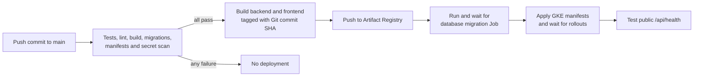

# CI/CD and automatic GCP releases

## What happens after a code change

Once the one-time activation below is complete, every push to GitHub `main`
updates the application in Google Cloud automatically:



| Change | Automatic result |
|---|---|
| Push to `main` | CI followed by production deployment |
| Pull request or another branch | CI only |
| Failed test, scan, build or manifest check | no deployment |
| Terraform source change | source is validated, infrastructure is not applied |
| GitHub Actions rerun | retries the same commit deployment |

Application CD and infrastructure management are intentionally separate.
Application commits are frequent and reversible. Terraform can create or
delete databases, clusters and IAM, so its plan, apply and destroy commands
require an operator.

## Workflow ownership

`.github/workflows/ci.yml` contains both CI and the `deploy-production` job.
The deployment job directly needs every release gate:

- backend tests, Ruff and Python compilation
- frontend dependency audit, lint and production build
- an empty-database Alembic migration
- Terraform formatting and validation
- Kustomize plus Kubernetes schema validation
- full-history Gitleaks scan

The job runs only for `github.ref == refs/heads/main`. GitHub's `production`
environment records the deployment and exposes only its environment values.
The `agentcare-production` concurrency group prevents two database migration
and rollout sequences from running together.

Images use the full 40-character Git commit SHA. No `latest` tag is deployed.
The same SHA is rendered into `APP_RELEASE` for trace filtering.

## Why the release applies Kubernetes manifests

The common one-container example is:

```bash
kubectl set image deployment/backend \
  backend=REGISTRY/backend:COMMIT_SHA
```

AgentCare has a backend image, frontend image and migration Job that must use
one release SHA. It also renders the public origin, GCS bucket, model profile
and optional Langfuse settings. A single imperative image command would leave
part of that release outside the declared state.

The pipeline instead:

1. copies `infra/k8s` to the runner's temporary directory
2. validates and replaces every environment sentinel
3. renders the same SHA into the migration, backend and frontend images
4. runs the migration Job and waits for success
5. applies the complete application overlay and waits for both rollouts

Tracked manifests are never edited. Kubernetes sees changed pod-template
image values and performs the backend and frontend rollout.

## Why it is not active immediately

Source code cannot create trust from GitHub to an existing Google project by
itself. Complete these one-time steps before the first public push:

1. create the public GitHub repository
2. apply the Terraform bootstrap with that repository's immutable IDs
3. initialize a new main state or migrate the existing state to the protected GCS bucket
4. create the GitHub `production` environment and its variables
5. create the runtime Kubernetes Secret once
6. add the organizer token as a GitHub Actions secret

After those steps, an ordinary `git push origin main` is enough.

## 1. Create the public repository

Create an empty repository under the account that will own the submission. Do
not initialize it with another README. From this checkout:

```bash
git remote add origin https://github.com/OWNER/REPOSITORY.git
git remote -v
```

Do not push yet. First configure the deployment identity so the first `main`
workflow can deploy.

Get immutable GitHub IDs:

```bash
gh api repos/OWNER/REPOSITORY --jq '{repository_id: .id, owner_id: .owner.id}'
```

Numeric IDs are used because owner and repository names can be renamed or
reused.

## 2. Authenticate the intended Google account

```bash
gcloud auth login
gcloud auth application-default login
gcloud config set project YOUR_PROJECT_ID
gcloud auth list --filter=status:ACTIVE --format='value(account)'
gcloud config get-value project
```

The visible account and project must be the new account you intend to use.
Terraform reads Application Default Credentials.

Check the tools:

```bash
gcloud --version
terraform -version
docker --version
docker buildx version
kubectl version --client
gke-gcloud-auth-plugin --version
curl --version
openssl version
```

## 3. Apply the keyless bootstrap

Set non-secret values:

```bash
export PROJECT_ID="YOUR_PROJECT_ID"
export REGION="europe-west3"
export GITHUB_REPOSITORY_ID="NUMERIC_REPOSITORY_ID"
export GITHUB_OWNER_ID="NUMERIC_OWNER_ID"
```

Enable the one API Terraform needs to manage the others:

```bash
gcloud services enable serviceusage.googleapis.com --project="$PROJECT_ID"
```

Plan and apply:

```bash
terraform -chdir=infra/bootstrap init
terraform -chdir=infra/bootstrap fmt -check
terraform -chdir=infra/bootstrap validate
terraform -chdir=infra/bootstrap plan \
  -out=/tmp/agentcare-bootstrap.tfplan \
  -var="project_id=$PROJECT_ID" \
  -var="region=$REGION" \
  -var="github_repository_id=$GITHUB_REPOSITORY_ID" \
  -var="github_repository_owner_id=$GITHUB_OWNER_ID"
terraform -chdir=infra/bootstrap apply /tmp/agentcare-bootstrap.tfplan
```

Capture the outputs:

```bash
export TF_STATE_BUCKET="$(
  terraform -chdir=infra/bootstrap output -raw terraform_state_bucket
)"
export GCP_WORKLOAD_IDENTITY_PROVIDER="$(
  terraform -chdir=infra/bootstrap output -raw workload_identity_provider
)"
export GCP_DEPLOYER_SERVICE_ACCOUNT="$(
  terraform -chdir=infra/bootstrap output -raw deployer_service_account_email
)"
```

The bootstrap creates no Google service-account key. GitHub exchanges its
short-lived OIDC token for the dedicated deployer identity.

## 4. Initialize the main stack

For a new Google account, initialize remote state and apply the main
infrastructure through the reviewed commands in
[GCP deployment](deployment-gcp.md#5-initialize-remote-state-and-create-infrastructure).
Capture its outputs before configuring GitHub. Point the public domain at the
Terraform `ingress_ip_address` output before the first automatic release.

For an existing environment with ignored local state, do not create a fresh
state and apply over those resources. Make a protected backup:

```bash
umask 077
cp infra/terraform/terraform.tfstate /tmp/agentcare-terraform-state.backup
```

Migrate the state to GCS:

```bash
terraform -chdir=infra/terraform init \
  -migrate-state \
  -backend-config="bucket=$TF_STATE_BUCKET"
terraform -chdir=infra/terraform state list
```

Review the state list before deleting the temporary backup. The GCS backend
uses state locking and the bootstrap bucket has object versioning, uniform
access and public access prevention.

## 5. Configure the GitHub production environment

In GitHub, open:

`Settings → Environments → New environment → production`

Restrict deployment branches to `main`. Do not add a required reviewer if you
want deployment to start immediately after CI.

Add these environment variables:

| Variable | Value source |
|---|---|
| `GCP_PROJECT_ID` | selected Google project ID |
| `GCP_REGION` | `europe-west3` or the Terraform region |
| `GCP_WORKLOAD_IDENTITY_PROVIDER` | bootstrap output |
| `GCP_DEPLOYER_SERVICE_ACCOUNT` | bootstrap output |
| `GKE_CLUSTER` | main Terraform `gke_cluster_name` output |
| `DOCUMENTS_BUCKET` | main Terraform `documents_bucket_name` output |
| `MODEL_ARMOR_TEMPLATE` | main Terraform `model_armor_template_name` output |
| `PUBLIC_URL` | complete HTTPS origin with no path |
| `LLM_PROFILE` | `vertex`, `groq` or another profile from `backend/llm.yaml` |
| `LANGFUSE_PUBLIC_KEY` | Langfuse project public key, or empty |
| `LANGFUSE_BASE_URL` | `https://cloud.langfuse.com` for EU Cloud |
| `LANGFUSE_SAMPLE_RATE` | `0` initially, `0.1` for normal observation or `1.0` for a short trace demo |

The environment contains no database password, JWT secret, model API key or
Langfuse secret key.

## 6. Create the runtime Secret once

The automatic workflow confirms `agentcare-secrets` exists but never reads or
prints it. Prepare the values locally:

```bash
umask 077
"${EDITOR:-vi}" /tmp/agentcare-secrets.env
```

Required shape:

```dotenv
LLM_API_KEY=
LLM_FALLBACK_API_KEY=
JWT_SECRET=
DATABASE_URL=
INTERNAL_TASK_TOKEN=
LANGFUSE_SECRET_KEY=
```

Vertex uses Workload Identity, so `LLM_API_KEY` can be empty when
`LLM_PROFILE=vertex`. Generate the JWT secret with:

```bash
openssl rand -hex 32
```

Apply without creating a tracked manifest:

```bash
kubectl create secret generic agentcare-secrets \
  --from-env-file=/tmp/agentcare-secrets.env \
  --dry-run=client -o yaml |
  kubectl apply -f -
rm /tmp/agentcare-secrets.env
```

A larger deployment should read these values from Secret Manager through the
GKE Secret Manager add-on. The current single Secret keeps the hackathon
deployment small and avoids duplicating secret stores.

## 7. Add the hackathon submission token

The organizer workflow reads one repository Actions secret named exactly:

```text
SUBMISSION_TOKEN
```

Add it through:

`Settings → Secrets and variables → Actions → New repository secret`

Do not place it in `.env`, a GitHub variable, Terraform, Kubernetes or a
command shown in CI logs. If a token has been pasted into chat or another
non-secret channel, rotate it in the challenge dashboard before adding it.

The CLI alternative avoids shell history:

```bash
read -s SUBMISSION_TOKEN
gh secret set SUBMISSION_TOKEN --body "$SUBMISSION_TOKEN"
unset SUBMISSION_TOKEN
```

## 8. Push and watch the first release

```bash
git push -u origin main
gh run list --limit 10
gh run watch
```

In GitHub, `Actions → ci` shows each gate and `deploy production`. The
repository home page shows the production environment and its current commit.

Verify independently:

```bash
curl -fsS --max-time 10 "https://YOUR_DOMAIN/api/health"
kubectl get deployment backend frontend
kubectl get job backend-migrate
```

## Failure behavior

| Failure | Result |
|---|---|
| test or security gate | no image build and no deployment |
| image build or push | current GKE release stays running |
| migration failure | migration logs are printed and app manifests are not applied |
| backend rollout failure | workflow fails and current state is visible in GKE |
| public health failure | deployment is marked failed after bounded retries |
| Langfuse unavailable | workflow processing continues without traces |

The workflow does not roll back a database migration automatically. Schema
rollback requires a reviewed migration and a database backup.

## Roll back application code

The auditable rollback is a Git revert:

```bash
git log --oneline -n 10
git revert BAD_COMMIT_SHA
git push origin main
```

That creates a new commit, rebuilds both images, runs the migration stage and
deploys through the same gates. Do not retag an old image as `latest`.

## Manual infrastructure lifecycle

Plan and apply infrastructure only when Terraform source or variables change:

```bash
terraform -chdir=infra/terraform init \
  -backend-config="bucket=$TF_STATE_BUCKET"
terraform -chdir=infra/terraform plan \
  -out=/tmp/agentcare.tfplan \
  -var="project_id=$PROJECT_ID" \
  -var="region=$REGION"
terraform -chdir=infra/terraform apply /tmp/agentcare.tfplan
```

Destroy is intentionally explicit:

```bash
kubectl delete -k infra/k8s/overlays/gcp
kubectl delete job backend-migrate --ignore-not-found
terraform -chdir=infra/terraform plan -destroy \
  -out=/tmp/agentcare-destroy.tfplan \
  -var="project_id=$PROJECT_ID" \
  -var="region=$REGION"
terraform -chdir=infra/terraform apply /tmp/agentcare-destroy.tfplan
```

Review the destroy plan. The GCS document bucket has deletion protection while
objects remain. The bootstrap state bucket and GitHub identity are separate so
they can redeploy the application later.

## Why Terraform does not run on every commit

Running Terraform in application CD would give a routine code push permission
to change IAM, delete SQL or replace the cluster. It would also couple a
two-minute application release to slow infrastructure reconciliation.

Companies normally use:

- fast automatic application CD after tested code merges
- a separate infrastructure plan with review and narrower frequency
- remote locked state
- short-lived workload identity instead of cloud keys
- commit-addressed release identifiers and deployment history

AgentCare follows that split without adding a second CI product.

Official references:

- [GitHub deployment environments](https://docs.github.com/en/actions/reference/workflows-and-actions/deployments-and-environments)
- [Google Workload Identity Federation for deployment pipelines](https://docs.cloud.google.com/iam/docs/workload-identity-federation-with-deployment-pipelines)
- [Google GitHub Actions authentication](https://github.com/google-github-actions/auth)
- [Terraform GCS backend](https://developer.hashicorp.com/terraform/language/backend/gcs)
