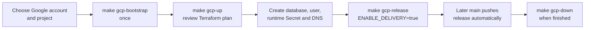

# Deploy AgentCare to Google Cloud

This is the canonical first-deployment and lifecycle runbook. It creates a new
GCP environment with Terraform, keeps credentials outside Git and enables
automatic application releases from GitHub.

## Ownership model

| Layer | Owner |
|---|---|
| APIs, state bucket and GitHub OIDC trust | local bootstrap Terraform |
| GKE, Cloud SQL, GCS, Model Armor, IAM and networking | local main Terraform |
| database user and runtime credentials | operator, outside Terraform state |
| backend/frontend release | `.github/workflows/ci.yml` |
| domain audit | AgentCare SQL |
| logs and metrics | Cloud Logging and Managed Service for Prometheus |
| optional model traces | Langfuse |

Terraform apply and destroy are not run by GitHub. The operator sees a saved
plan before typing `apply`. Application releases remain automatic.

The Autopilot cluster uses private nodes. A Cloud Router and Public NAT cover
only the selected cluster subnetwork, so workloads can reach the configured
model and tracing endpoints without external IP addresses on GKE nodes. NAT
logs contain errors only to limit both telemetry volume and cost; the public
control-plane endpoint remains enabled for the keyless GitHub release job.

## Lifecycle



Follow this order exactly: run `make gcp-bootstrap` once; run `make gcp-up` to
review/apply Terraform and install the platform bundle; create the database
user and `agentcare/agentcare-secrets` as the operator; discover/configure the
public URL; then run `make gcp-release ENABLE_DELIVERY=true`. Later successful
`main` pushes are application-only releases. `make gcp-down` is a manual,
reviewed destroy. Do not use a code push to provision or replace infrastructure.

The platform bundle is operator-owned: it creates the `agentcare` namespace,
the runtime KSA and the deployer RoleBinding. CI only releases application
resources through that pre-existing namespaced binding.

## 1. Check local tools

```bash
gcloud version
gke-gcloud-auth-plugin --version
terraform version
kubectl version --client
docker version
docker buildx version
gh --version
openssl version
```

Terraform 1.7+ is required. The committed workflow uses Terraform 1.15.8.

Install missing Google components:

```bash
gcloud components install gke-gcloud-auth-plugin kubectl
```

## 2. Use the intended Google account

Create a named gcloud configuration so switching accounts later is explicit:

```bash
gcloud config configurations create agentcare --activate
gcloud auth login
gcloud auth application-default login
```

List accounts without printing any token:

```bash
gcloud auth list
gcloud config list account
gcloud auth application-default print-access-token >/dev/null
```

The active gcloud account controls project commands. Application Default
Credentials are what local Terraform uses. Both must belong to the intended
account.

To switch later:

```bash
gcloud auth login
gcloud auth application-default login
gcloud config set account YOUR_GOOGLE_ACCOUNT
```

Do not use a service-account JSON key for this deployment.

## 3. Choose or create a project

Set a globally unique project ID:

```bash
export PROJECT_ID=your-unique-agentcare-project
export REGION=europe-west3
```

Use an existing project:

```bash
gcloud config set project "$PROJECT_ID"
gcloud projects describe "$PROJECT_ID"
```

Or create one and link billing:

```bash
gcloud projects create "$PROJECT_ID" --name="AgentCare"
gcloud beta billing accounts list
gcloud beta billing projects link "$PROJECT_ID" \
  --billing-account=YOUR_BILLING_ACCOUNT_ID
gcloud config set project "$PROJECT_ID"
```

Confirm before provisioning:

```bash
gcloud config get-value account
gcloud config get-value project
gcloud beta billing projects describe "$PROJECT_ID"
```

Set a budget alert in `Google Cloud Console → Billing → Budgets & alerts`.
Budget alerts notify; they do not automatically stop resources.

## 4. Confirm GitHub and capture immutable IDs

```bash
gh auth login
gh auth status
gh repo view --json nameWithOwner,url,visibility
```

The repository must be public before hackathon submission.

```bash
export REPOSITORY="$(
  gh repo view --json nameWithOwner --jq .nameWithOwner
)"
export GITHUB_REPOSITORY_ID="$(
  gh api "repos/${REPOSITORY}" --jq .id
)"
export GITHUB_OWNER_ID="$(
  gh api "repos/${REPOSITORY}" --jq .owner.id
)"
```

```bash
printf 'repository=%s\nrepository-id=%s\nowner-id=%s\n' \
  "$REPOSITORY" "$GITHUB_REPOSITORY_ID" "$GITHUB_OWNER_ID"
```

Numeric IDs remain stable if a repository or account is renamed.

## 5. Bootstrap once

The bootstrap creates:

- a versioned GCS bucket for main Terraform state
- required Google APIs
- one narrow GitHub application deployer
- one Workload Identity pool/provider restricted to the production workflow

```bash
make gcp-bootstrap \
  PROJECT_ID="$PROJECT_ID" \
  REGION="$REGION" \
  GITHUB_REPOSITORY_ID="$GITHUB_REPOSITORY_ID" \
  GITHUB_OWNER_ID="$GITHUB_OWNER_ID"
```

Review the displayed plan and type `apply`.

Capture the state bucket:

```bash
export TF_STATE_BUCKET="$(
  terraform -chdir=infra/bootstrap output -raw terraform_state_bucket
)"
printf 'state-bucket=%s\n' "$TF_STATE_BUCKET"
```

The bootstrap state itself is local and ignored because it creates the remote
state bucket. Back it up to encrypted storage outside the repository. The main
stack state is remote, versioned and shared across fresh clones.

The bootstrap enables these services:

```text
aiplatform.googleapis.com
artifactregistry.googleapis.com
cloudresourcemanager.googleapis.com
compute.googleapis.com
container.googleapis.com
dns.googleapis.com
iam.googleapis.com
iamcredentials.googleapis.com
logging.googleapis.com
modelarmor.googleapis.com
monitoring.googleapis.com
networkconnectivity.googleapis.com
servicenetworking.googleapis.com
serviceusage.googleapis.com
sqladmin.googleapis.com
storage.googleapis.com
sts.googleapis.com
```

## 6. Create the main infrastructure

Production uses Vertex plus Model Armor:

```bash
make gcp-up \
  PROJECT_ID="$PROJECT_ID" \
  REGION="$REGION" \
  GCS_LOCATION="$REGION" \
  ENABLE_CLOUD_SQL=true \
  ENABLE_MODEL_ARMOR=true \
  ENABLE_VERTEX_AI=true
```

Groq remains an optional local profile. It is not in the active GCP path.

`gcp-up` always passes the same complete variable set used by destroy:

- project and region
- GCS location
- VPC and subnet names
- Cloud SQL, Model Armor and Vertex feature flags

It saves the plan, displays it and applies only after you type `apply`.

Inspect outputs:

```bash
terraform -chdir=infra/terraform output
```

## 7. Create the database and runtime Secret

Terraform creates the private Cloud SQL instance but does not put a database
password into state. These are operator actions, not CI actions: GitHub never
reads or creates the Secret and cannot access Secrets, RBAC, namespaces, KSAs,
`exec`, `attach`, `portforward` or impersonation.

Create the application database:

```bash
gcloud sql databases create agentcare \
  --instance=agentcare-postgres \
  --project="$PROJECT_ID"
```

Generate a URL-safe password and create the user:

```bash
DB_PASSWORD="$(openssl rand -hex 24)"
gcloud sql users create agentcare \
  --instance=agentcare-postgres \
  --project="$PROJECT_ID" \
  --password="$DB_PASSWORD"
```

Resolve the exact Terraform cluster and database:

```bash
export GKE_CLUSTER="$(
  terraform -chdir=infra/terraform output -raw gke_cluster_name
)"
export GKE_LOCATION="$(
  terraform -chdir=infra/terraform output -raw gke_cluster_location
)"
export DB_HOST="$(
  terraform -chdir=infra/terraform output -raw cloud_sql_private_ip_address
)"
export GKE_CONTEXT="gke_${PROJECT_ID}_${GKE_LOCATION}_${GKE_CLUSTER}"
```

```bash
gcloud container clusters get-credentials "$GKE_CLUSTER" \
  --region="$GKE_LOCATION" \
  --project="$PROJECT_ID"
kubectl --context "$GKE_CONTEXT" get namespace agentcare
```

Read the private reviewer identity and optional tracing secret without echo:

```bash
read -r AGENTCARE_STAFF_EMAIL
read -s AGENTCARE_STAFF_PASSWORD
printf '\n'
read -s LANGFUSE_SECRET_KEY
printf '\n'
```

Create a temporary mode-600 environment file outside the repository:

```bash
umask 077
SECRET_ENV="$(mktemp)"
trap 'rm -f "$SECRET_ENV"' EXIT
JWT_SECRET="$(openssl rand -hex 32)"
INTERNAL_TASK_TOKEN="$(openssl rand -hex 32)"
DATABASE_URL="postgresql+psycopg://agentcare:${DB_PASSWORD}@${DB_HOST}:5432/agentcare?sslmode=require"
```

```bash
{
  printf 'LLM_API_KEY=\n'
  printf 'LLM_FALLBACK_API_KEY=\n'
  printf 'JWT_SECRET=%s\n' "$JWT_SECRET"
  printf 'DATABASE_URL=%s\n' "$DATABASE_URL"
  printf 'INTERNAL_TASK_TOKEN=%s\n' "$INTERNAL_TASK_TOKEN"
  printf 'LANGFUSE_SECRET_KEY=%s\n' "$LANGFUSE_SECRET_KEY"
  printf 'AGENTCARE_STAFF_EMAIL=%s\n' "$AGENTCARE_STAFF_EMAIL"
  printf 'AGENTCARE_STAFF_PASSWORD=%s\n' "$AGENTCARE_STAFF_PASSWORD"
  printf 'AGENTCARE_STAFF_NAME=AgentCare reviewer\n'
} >"$SECRET_ENV"
```

```bash
kubectl --context "$GKE_CONTEXT" --namespace=agentcare create secret generic agentcare-secrets \
  --from-env-file="$SECRET_ENV" \
  --dry-run=client -o yaml \
  | kubectl --context "$GKE_CONTEXT" --namespace=agentcare apply -f -
rm -f "$SECRET_ENV"
unset DB_PASSWORD DATABASE_URL JWT_SECRET INTERNAL_TASK_TOKEN
unset AGENTCARE_STAFF_EMAIL AGENTCARE_STAFF_PASSWORD LANGFUSE_SECRET_KEY
```

Verify only the Secret name and keys, not values:

```bash
kubectl --context "$GKE_CONTEXT" --namespace=agentcare get secret agentcare-secrets -o name
kubectl --context "$GKE_CONTEXT" --namespace=agentcare get secret agentcare-secrets \
  -o go-template='{{range $k, $_ := .data}}{{printf "%s\n" $k}}{{end}}'
```

For local `.env`, a non-development JWT can be checked without showing it:

```bash
grep -Eq 'JWT_SECRET=.{32,}' .env
```

## 8. Choose the new public URL

Get the reserved IP:

```bash
export INGRESS_IP="$(
  terraform -chdir=infra/terraform output -raw ingress_ip_address
)"
```

For a hackathon demo without buying a domain:

```bash
export PUBLIC_HOST="${INGRESS_IP}.sslip.io"
export PUBLIC_URL="https://${PUBLIC_HOST}"
printf 'new-public-url=%s\n' "$PUBLIC_URL"
```

For a company domain, create an A record pointing to `INGRESS_IP`, then set
`PUBLIC_URL` to that HTTPS origin. Never reuse a hostname that points at a
destroyed load balancer. The production workflow publishes this final URL in
the GitHub `production` environment and its job summary after a release.

## 9. Configure Langfuse, or leave it off

Default:

```bash
export LANGFUSE_PUBLIC_KEY=
export LANGFUSE_BASE_URL=https://cloud.langfuse.com
export LANGFUSE_SAMPLE_RATE=0
```

For a short synthetic demo:

```bash
export LANGFUSE_PUBLIC_KEY=pk-lf-your-project
export LANGFUSE_BASE_URL=https://cloud.langfuse.com
export LANGFUSE_SAMPLE_RATE=1
```

For normal low-volume observation, use `0.1`. The secret key is already in the
Kubernetes Secret. Langfuse receives an allowlist of operational fields, not
prompts, responses, patient identifiers or tool values.

## 10. Migration preflight, release and wait

Before the first release that includes the duplicate-appointment migration,
check for an existing overlapping appointment. If one exists, the operator must
cancel one appointment through the normal application/domain path so its audit
history remains intact, then rerun the release. Never delete the row or bypass
the migration to force deployment.

Release only after that preflight succeeds:

```bash
make gcp-release \
  PROJECT_ID="$PROJECT_ID" \
  REGION="$REGION" \
  PUBLIC_URL="$PUBLIC_URL" \
  ENABLE_DELIVERY=true \
  ENABLE_VERTEX_AI=true \
  LLM_PROFILE=vertex \
  LANGFUSE_PUBLIC_KEY="$LANGFUSE_PUBLIC_KEY" \
  LANGFUSE_BASE_URL="$LANGFUSE_BASE_URL" \
  LANGFUSE_SAMPLE_RATE="$LANGFUSE_SAMPLE_RATE"
```

The local, operator-side command:

1. synchronizes non-secret GitHub production variables
2. checks that the Secret has database, JWT and private staff keys without
   printing their values
3. confirms local `main` equals `origin/main`
4. arms `DEPLOY_ENABLED` only immediately before dispatching `ci.yml`
5. waits for the workflow result and disables delivery if a post-arm release
   fails

After this activation, every successful push to `main` releases automatically.
It does not run Terraform or recreate GKE, Cloud SQL, IAM, networking, DNS or
the load balancer.

## 11. Verify the environment

GitHub:

```bash
gh run list --workflow ci.yml --limit 5
gh run view --log-failed
```

Kubernetes:

```bash
make gcp-status \
  PROJECT_ID="$PROJECT_ID" \
  PUBLIC_URL="$PUBLIC_URL"
```

Direct checks:

```bash
kubectl --context "$GKE_CONTEXT" --namespace=agentcare get pods,services,ingress
kubectl --context "$GKE_CONTEXT" --namespace=agentcare rollout status deployment/backend
kubectl --context "$GKE_CONTEXT" --namespace=agentcare rollout status deployment/frontend
```

Replace `YOUR_DOMAIN` with the newly created hostname:

```bash
curl -fsS --max-time 10 "https://YOUR_DOMAIN/api/health"
```

### Verify document storage

Use only a synthetic file:

```bash
export SMOKE_FILENAME="agentcare-smoke.txt"
printf 'synthetic referral letter for cardiology scheduling\n' \
  >"/tmp/${SMOKE_FILENAME}"
```

After login, create a request with the API or UI. The upload form sends:

```text
files=@/tmp/${SMOKE_FILENAME};type=text/plain
```

Confirm the object reached the Terraform-owned bucket:

```bash
export DOCUMENTS_BUCKET="$(
  terraform -chdir=infra/terraform output -raw documents_bucket_name
)"
gcloud storage ls "gs://${DOCUMENTS_BUCKET}/**${SMOKE_FILENAME}"
```

### Verify Model Armor

```bash
gcloud model-armor templates describe agentcare \
  --location="$REGION" \
  --project="$PROJECT_ID"
```

Submit a synthetic injection phrase through the UI. Confirm the request is
blocked or escalated and inspect the audit record. Do not use real patient
text.

Model Armor screens injection, jailbreak and malicious URLs. Local Presidio
redaction still runs before this provider call. See [security](security.md).

### Verify observability

Cloud logs:

```bash
gcloud logging read \
  'resource.type="k8s_container" AND resource.labels.container_name="backend"' \
  --project="$PROJECT_ID" \
  --limit=20
```

Metrics:

`Google Cloud Console → Monitoring → Metrics Explorer → PromQL`

Langfuse:

Open the configured Langfuse project and filter for trace
`agentcare-workflow`. Allow a few seconds for asynchronous export. See
[observability](observability.md) for privacy and sampling details.

## Cost and idle behavior

Prices change by region and billing account. Check the linked pricing pages and
the Cloud Billing report before leaving the environment running.

Main idle cost drivers:

| Resource | Idle behavior |
|---|---|
| GKE Autopilot | $0.10/cluster-hour management fee, often offset by the one-cluster monthly free-tier credit; running pod requests are billed separately |
| Cloud NAT | gateway use, processed traffic, one automatically allocated public IP and network egress; Cloud Router itself has no charge |
| Cloud SQL | instance runs and bills continuously |
| HTTPS load balancer | first five forwarding rules are currently $0.025/hour, plus IP and traffic charges |
| GCS and Artifact Registry | stored bytes and operations |
| Model Armor | currently free for the first 2 million tokens/month, then usage-priced |
| Cloud Logging/Monitoring | ingestion and retention beyond allowances |
| Langfuse | plan and event volume chosen in the external project |

Official pricing:

- [GKE](https://cloud.google.com/kubernetes-engine/pricing)
- [Cloud NAT](https://cloud.google.com/nat/pricing)
- [Cloud SQL](https://cloud.google.com/sql/pricing)
- [Cloud Load Balancing](https://cloud.google.com/load-balancing/pricing)
- [Model Armor](https://cloud.google.com/security/products/model-armor)
- [Google Cloud Pricing Calculator](https://cloud.google.com/products/calculator)

View actual charges:

`Google Cloud Console → Billing → Reports`

This repository cannot know cost incurred before it authenticates to the chosen
billing account.

## Destroy

`gcp-down` shows the exact Terraform destroy plan, asks for the full project
ID, binds Kubernetes commands to the Terraform-owned cluster context, verifies
the Terraform-owned documents bucket and then destroys the main stack:

```bash
make gcp-down \
  PROJECT_ID="$PROJECT_ID" \
  REGION="$REGION" \
  GCS_LOCATION="$REGION" \
  ENABLE_CLOUD_SQL=true \
  ENABLE_MODEL_ARMOR=true \
  ENABLE_VERTEX_AI=true
```

Document objects and Cloud SQL data are permanently deleted.

Google can retain the private service-networking connection for several days.
Retry only the remaining Terraform destroy:

```bash
make gcp-cleanup \
  PROJECT_ID="$PROJECT_ID" \
  REGION="$REGION" \
  GCS_LOCATION="$REGION" \
  ENABLE_CLOUD_SQL=true \
  ENABLE_MODEL_ARMOR=true \
  ENABLE_VERTEX_AI=true
```

What remains after `gcp-down`:

- bootstrap Terraform state
- versioned remote-state bucket
- enabled APIs
- narrow GitHub deployer and Workload Identity provider

Keeping bootstrap makes the next `gcp-up` possible. Destroy it only after the
main state is no longer needed and its bucket is empty.

The current deployment uses the shared/default VPC, so this runbook deliberately
does not set Terraform `deletion_policy = "ABANDON"` or automatically adopt an
existing service-networking connection. Abandoning the connection can leave the
managed range behind; adopting/updating a shared connection can affect unrelated
services. Wait for Google's delayed cleanup and retry `make gcp-cleanup`. A
future dedicated AgentCare VPC can move both connection and range into durable
bootstrap state.

## Fresh-clone recovery

A new clone can operate the main stack because its state is in GCS. It does not
need, contain or recreate local `.env` values; those remain local-only. The
existing operator-owned `agentcare/agentcare-secrets` Secret stays in the
cluster, and `SUBMISSION_TOKEN` stays only in GitHub Secrets:

```bash
git clone https://github.com/OWNER/REPOSITORY.git
cd REPOSITORY
export PROJECT_ID=your-project
export TF_STATE_BUCKET="${PROJECT_ID}-agentcare-tfstate"
terraform -chdir=infra/terraform init \
  -backend-config="bucket=$TF_STATE_BUCKET"
terraform -chdir=infra/terraform state list
```

Restore the encrypted bootstrap state backup before changing bootstrap
resources. If it is lost, import those resources instead of applying duplicate
trust resources.

## Common failures

| Failure | Resolution |
|---|---|
| wrong Google account | activate the named configuration, then redo gcloud and ADC login |
| billing disabled | link a billing account before bootstrap |
| default VPC absent | pass existing `NETWORK_NAME` and `SUBNETWORK_NAME` |
| WIF denied | confirm repository/owner IDs, `main`, environment and `ci.yml` |
| `agentcare-secrets` missing | operator completes section 7 in the exact `agentcare` namespace |
| certificate pending | verify `PUBLIC_HOST` resolves to `INGRESS_IP` and wait |
| migration failed | inspect `kubectl logs job/backend-migrate` |
| duplicate appointment migration preflight | cancel one existing overlapping appointment to preserve its audit trail, then rerun; never delete it or bypass the migration |
| Model Armor unavailable | check template, PSC endpoint, private DNS and runtime IAM |
| destroy leaves networking | wait and run `make gcp-cleanup` |
