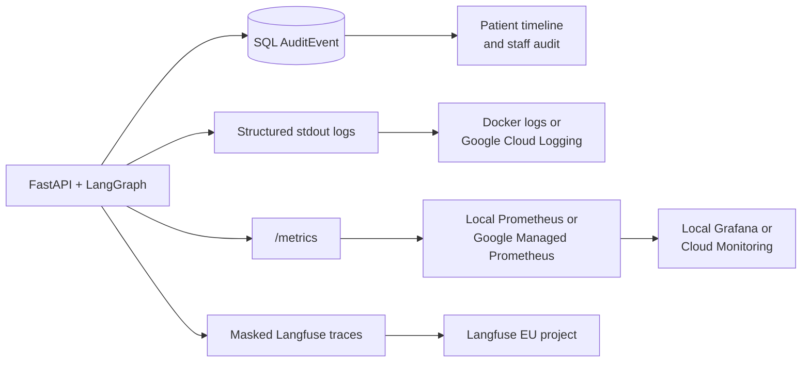

# Observability and audit

AgentCare uses four signals because they answer different questions. Combining
them into one store would weaken both operational diagnosis and business
audit.



## Which signal to use

| Question | Correct source |
|---|---|
| Who approved or changed a patient workflow? | SQL `AuditEvent` and staff audit UI |
| Did an agent tool mutate the database? | SQL `AuditEvent` |
| Is the API slow or returning 5xx? | Prometheus metrics |
| Which model call was slow or expensive? | Langfuse trace |
| Why did a process crash? | structured application logs |
| What is the patient allowed to see? | persisted workflow state and audit-backed SSE |

Langfuse, Prometheus and logs are optional operational systems. None replaces
the persisted SQL audit required by the challenge.

## SQL audit and SSE

Domain mutations and agent node exits write `AuditEvent` in the same database
transaction as their business change. The staff audit page and patient
workflow timeline read those rows.

Use this source for:

- actor and timestamp
- action and entity identity
- approval, rejection and escalation history
- tool and agent progress

The audit context stores bounded identifiers and counts. It does not store API
keys or raw values removed by PII redaction.

## Structured logs

The backend writes structured events to stdout. Docker shows them locally:

```bash
docker compose logs --follow backend
```

GKE collects the same stream in Cloud Logging. Filter by Kubernetes container:

```text
resource.type="k8s_container"
resource.labels.container_name="backend"
```

The logging processor redacts values whose keys contain password, token,
authorization, API key or secret. Code must still avoid placing patient text
in log messages.

## Prometheus metrics

`prometheus-fastapi-instrumentator` exposes HTTP metrics at:

```text
http://localhost:8000/metrics
```

Local Compose runs Prometheus at:

```text
http://localhost:9090
```

Useful queries from the committed dashboard:

```promql
sum(rate(http_requests_total[5m])) by (handler)
```

```promql
histogram_quantile(
  0.99,
  sum(rate(http_request_duration_seconds_bucket[5m])) by (le, handler)
)
```

```promql
sum(rate(http_requests_total{status=~"5.."}[5m]))
```

Metrics contain route templates, status codes, counts and durations. Do not
add patient IDs, emails, request text or document names as labels. Those
high-cardinality values are both a privacy risk and a monitoring cost risk.

## Grafana

Local Compose runs Grafana at:

```text
http://localhost:3001
```

The local demonstration uses:

```text
username: admin
password: admin
```

Anonymous access is viewer-only. This credential is for local synthetic data,
not production.

The provisioned `AgentCare` dashboard shows:

- request rate by handler
- p50 and p99 latency
- 5xx rate
- request rate by HTTP status

Grafana is a visualization layer, not a metrics database. It reads Prometheus.
Deleting local Grafana would remove the ready dashboard but not application
metrics. Keeping it costs nothing while Compose is stopped.

## Metrics in Google Cloud

The GCP overlay applies:

```text
infra/k8s/overlays/gcp/podmonitoring.yaml
```

GKE managed collection scrapes the backend every 30 seconds and stores the
metrics in Google Managed Service for Prometheus. View them in:

`Google Cloud Console → Monitoring → Metrics Explorer`

Use the PromQL tab and the same queries shown above. Google Managed Prometheus
uses the Cloud Monitoring backend, so a future company Grafana instance can
query the same data without replacing collection.

AgentCare does not deploy Grafana to GCP. A dedicated Grafana pod would add
authentication, persistent storage, patching and idle cost only to duplicate
Cloud Monitoring for one service. A larger company could use Grafana Cloud,
Managed Grafana or a central internal Grafana shared by many services.

Official reference:
[Google Managed Service for Prometheus](https://cloud.google.com/stackdriver/docs/managed-prometheus).

## Langfuse

Langfuse traces LangGraph and LangChain execution. AgentCare keeps it instead
of adding LangSmith because a second callback backend would duplicate traces,
configuration, privacy review and cost.

When enabled, Langfuse shows:

- the `agentcare-workflow` trace tree
- agent and model call timing
- model name and parameters
- input and output token counts
- provider-reported cost details
- observation type, level and error type
- release SHA and environment

It intentionally does not show:

- request or document text
- prompts, messages or model output
- tool arguments or tool results
- workflow, patient, user or session identifiers
- metadata or exception messages

`backend/app/observability/tracing.py` applies an export allowlist through the
Langfuse SDK's `mask_otel_spans` hook. Unknown attributes are deleted. This is
safer than trying to predict every content field introduced by future
LangChain versions.

Official references:
[Langfuse masking](https://langfuse.com/docs/observability/features/masking)
and [Langfuse sampling](https://langfuse.com/docs/observability/features/sampling).

## Enable Langfuse locally

Create a Langfuse project in the EU region, then add only local values to
`.env`:

```dotenv
LANGFUSE_PUBLIC_KEY=pk-lf-...
LANGFUSE_SECRET_KEY=sk-lf-...
LANGFUSE_BASE_URL=https://cloud.langfuse.com
LANGFUSE_SAMPLE_RATE=1.0
APP_RELEASE=local
```

Start the stack and submit a synthetic administrative request:

```bash
docker compose up --build
```

Open the Langfuse project and filter for:

```text
trace name: agentcare-workflow
environment: dev
```

The SDK exports asynchronously. Allow a few seconds after the request.

Check the keys directly without printing them:

```bash
.venv/bin/python -c \
  'from langfuse import Langfuse; print(Langfuse().auth_check())'
```

## Enable Langfuse in GKE

1. Put `LANGFUSE_SECRET_KEY` in the existing operator-owned
   `agentcare/agentcare-secrets` Kubernetes Secret.
2. Add `LANGFUSE_PUBLIC_KEY`, `LANGFUSE_BASE_URL` and
   `LANGFUSE_SAMPLE_RATE` to the GitHub `production` environment.
3. Push a commit to `main`.
4. Submit a synthetic request and inspect the Langfuse trace.

The next automatic release renders the public settings into the ConfigMap.
The secret key never enters GitHub environment variables or rendered
manifests.

## Sampling and cost

Sampling is decided for the complete trace:

| Rate | Use |
|---|---|
| `0` | tracing disabled, default |
| `0.1` | normal demo or low-cost production observation |
| `1.0` | short synthetic demo or debugging window |

At `0.1`, roughly one in ten workflows sends its complete operational trace.
An unsampled trace sends no child observations. This reduces Langfuse event
volume and storage.

Additional cost controls:

- inputs, outputs and media are not exported
- one Langfuse client is reused per process
- the exporter shuts down and flushes during application shutdown
- tracing failures fail open to normal workflow processing
- Prometheus labels remain low-cardinality
- no production Grafana service is deployed

Pricing and free-tier limits change. Check the Langfuse usage page and Google
Cloud Billing before raising sample rate or retention.

As checked on 2026-07-28, Langfuse Cloud Hobby is free with 50,000 units per
month, 30 days of data access and two users. One trace, observation or score is
one unit. The application default of zero sampling costs nothing. See
[Langfuse pricing](https://langfuse.com/pricing) and
[billable units](https://langfuse.com/docs/administration/billable-units).

## Privacy boundary

The masking tests use fake span batches containing request text, patient IDs,
tool arguments, model output and exception text. They assert those attributes
are deleted while token and cost fields remain.

This control reduces exposure but does not certify healthcare compliance.
Before real patient use, an operator must review data residency, retention,
access control, contractual terms and regulatory requirements for every
external observability provider. The hackathon deployment should use synthetic
data only.
